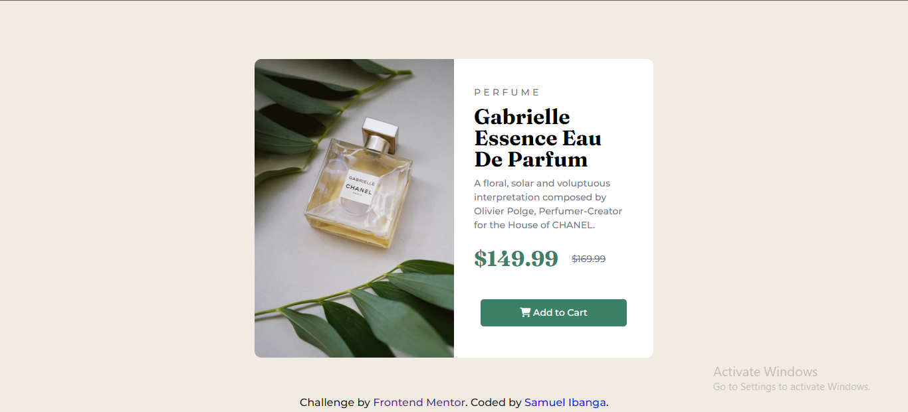
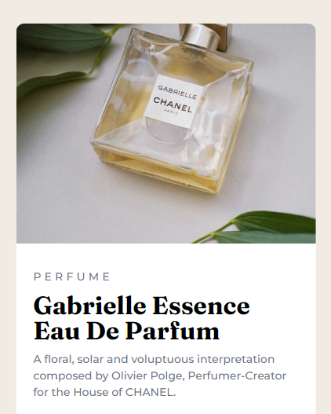

# Frontend Mentor - Product preview card component solution

This is a solution to the [Product preview card component challenge on Frontend Mentor](https://www.frontendmentor.io/challenges/product-preview-card-component-GO7UmttRfa). Frontend Mentor challenges help you improve your coding skills by building realistic projects. 

## Table of contents

- [The challenge](#the-challenge)
- [Screenshot](#screenshot)
- [Links](#links)
- [Built with](#built-with)
- [What I learned](#what-i-learned)
- [Author](#author)
- [Acknowledgments](#acknowledgments)


### The challenge

Users should be able to:

- View the optimal layout depending on their device's screen size
- See hover and focus states for interactive elements

### Screenshot




### Built with

- Semantic HTML5 markup
- CSS custom properties
- Flexbox
- Mobile-first workflow

### What I learned

I learnt how to arrange elements in the mobile screen views using flexbox and positioning properties.

To see how you can add code snippets, see below:

```html
<body>

  <div class="container">
    
    <div class="right">
      <p class="perfume">PERFUME</p>

      <h2>Gabrielle Essence Eau De Parfum</h2>

      <p>A floral, solar and voluptuous interpretation composed by Olivier Polge,
        Perfumer-Creator for the House of CHANEL.</p>

      <div class="price">
        <h1>$149.99</h1>
        <p><s>$169.99</s></p>
      </div>
      ...
</body>
```
```css
.container{
    width: 600px;
    height: 450px;
    margin: auto;
    align-self: center;
    display: flex;
    background-color: var(--white);
    border-radius: 10px;
    position: absolute;
    top: 50%;
    left: 50%;
    transform: translate(-50%, -50%);
}

```

- Frontend Mentor - [@SamuelIbanga5](https://www.frontendmentor.io/profile/SamuelIbanga5)
- Twitter - [@Ibangajnr10](https://www.twitter.com/Ibangajnr10)

